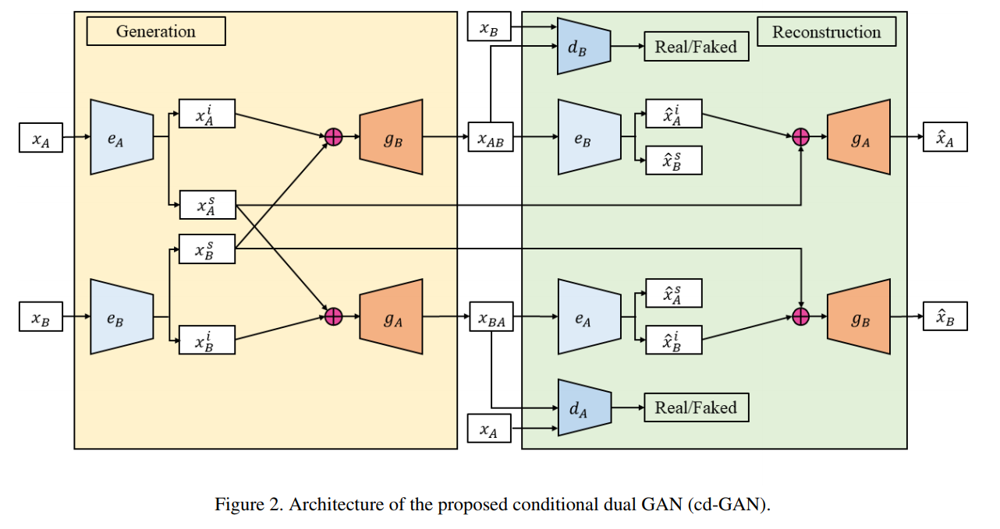
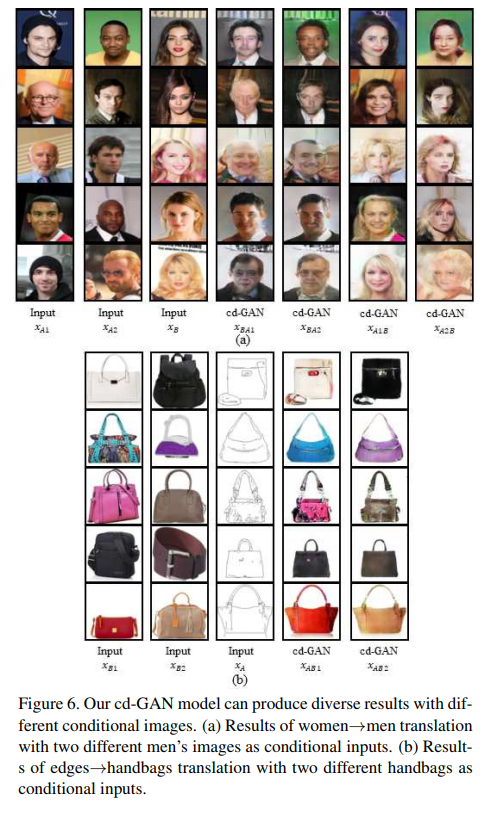

# pytorch-Conditional-image-to-image-translation
Pytorch implementation of Conditional image-to-image translation [1] (CVPR 2018)
* Parameters without information in the paper were set arbitrarily. (I could not find the supplementary document)


## Usage
```
python train.py --dataset dataset
```

### Folder structure
The following shows basic folder structure.
```
├── data
    ├── dataset # not included in this repo
        ├── trainA
            ├── aaa.png
            ├── bbb.jpg
            └── ...
        ├── trainB
            ├── ccc.png
            ├── ddd.jpg
            └── ...
        ├── testA
            ├── eee.png
            ├── fff.jpg
            └── ...
        └── testB
            ├── ggg.png
            ├── hhh.jpg
            └── ...
├── train.py # training code
├── utils.py
├── networks.py
└── name_results # results to be saved here
```

## Resutls
### paper results


### celebA gender translation results
<table align='center'>
<tr align='center'>
<td> InputA - InputB - A2B - B2A (this repo) </td>
</tr>
<tr>
<td>
</tr>
<tr>
<td>
</tr>
<tr>
<td>
</tr>
<tr>
<td>
</tr>
<tr>
<td>
</tr>
<tr>
<td>
</tr>
<tr>
<td>
</tr>
<tr>
<td>
</tr>
<tr>
<td>
</tr>
</table>

## Development Environment
* NVIDIA GTX 1080 ti
* cuda 8.0
* python 3.5.3
* pytorch 0.4.0
* torchvision 0.2.1

## Reference
[1] Lin, Jianxin, et al. "Conditional image-to-image translation." The IEEE Conference on Computer Vision and Pattern Recognition (CVPR)(July 2018). 2018.

(Full paper: http://openaccess.thecvf.com/content_cvpr_2018/papers/Lin_Conditional_Image-to-Image_Translation_CVPR_2018_paper.pdf)
